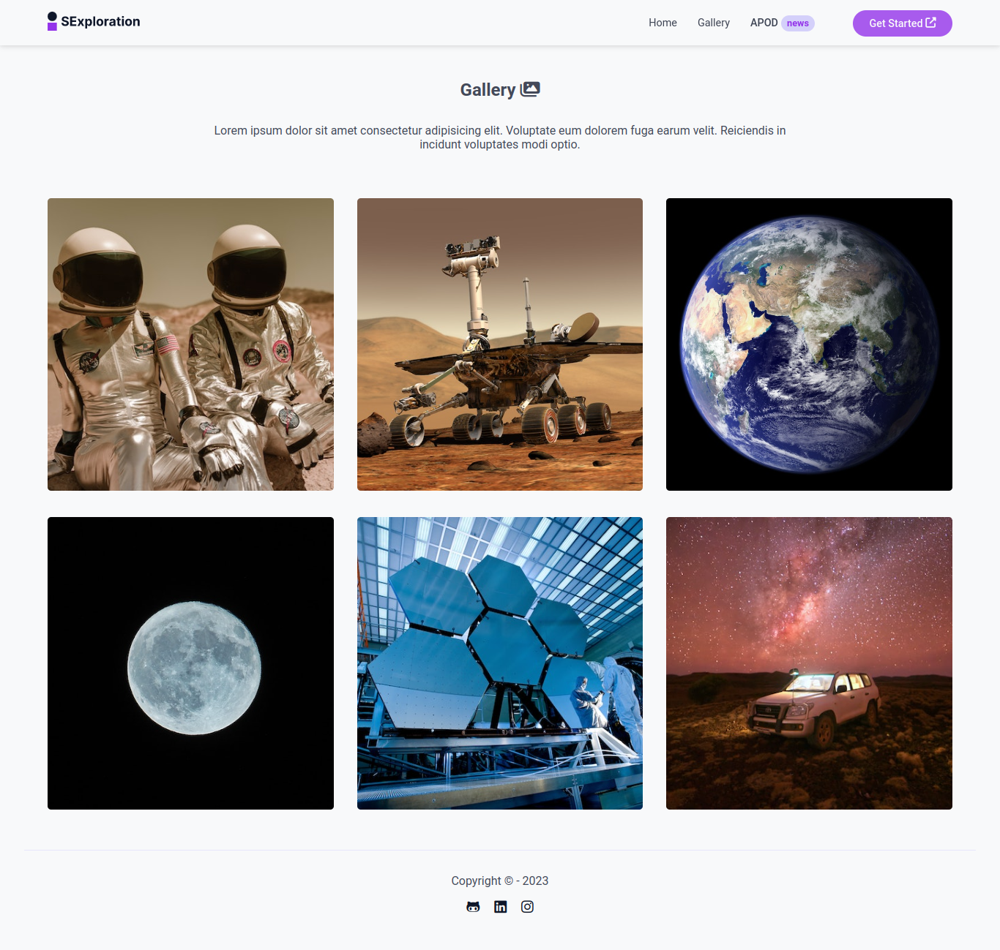
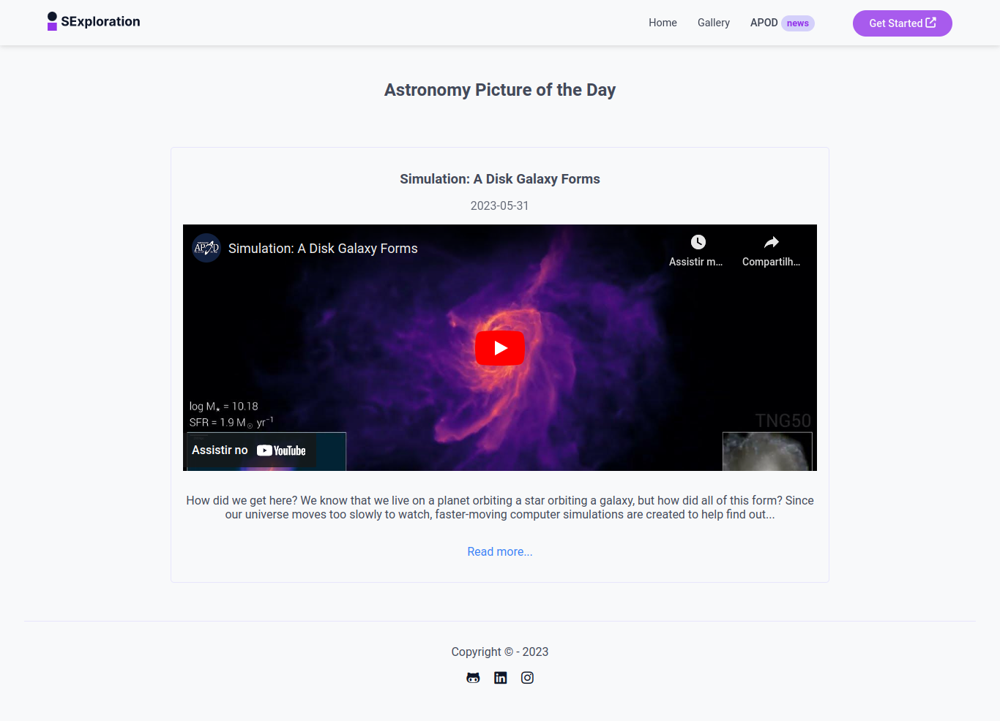

### Space Exploration 🔭

Aplicação desenvolvida com <b>HTML, CSS (Grid, Flexbox) e Javascript</b>, juntamente com a utilização da <b>[API da Nasa - APOD](https://apod.nasa.gov/apod/astropix.html) (Astronomy Picture of the Day)</b>, do uso do <b>Vite JS para gerar o bundle do projeto</b>, e entre outras tecnologias.

O projeto consiste na utilização do recurso de <b>SPA (Single Page Application) com Vanilla JS.</b>

